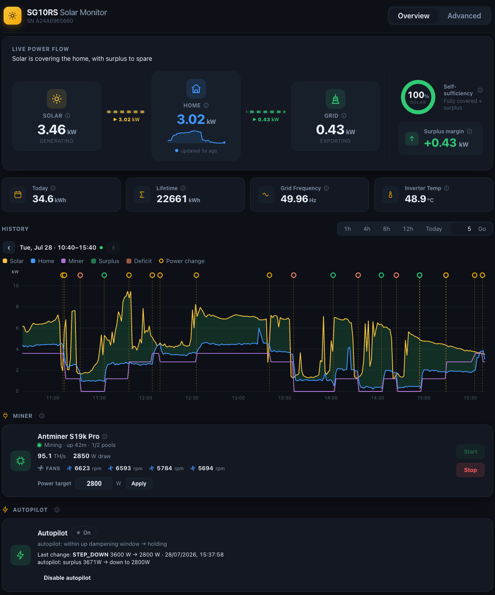

# Solar-Surplus Miner Autopilot

**Run a Bitcoin miner on your spare solar — automatically, and gently enough not to stress the hardware.**

This is one small self-contained app that watches your home solar setup and, if you let it, turns a Bitcoin miner up and down through the day so it only ever eats the sunshine you'd otherwise export to the grid. When a cloud rolls over it eases the miner back down; when the sun returns it winds it back up — smoothly, in small steps, never yanking it around.



It talks to three things:

- **☀ Solar inverter** — Sungrow **SG10RS** (via the WiNet-S dongle's local API) — how much power the sun is making right now.
- **🏠 Whole-home usage** — **Solar Analytics** (their clip-on meter, read via their cloud) — how much the house is actually using.
- **⛏ The miner** — **Braiins OS+** on an **Antminer S19k Pro** (via its local API) — start/stop it and set how much power it's allowed to draw.

From those it works out your **spare solar** ("surplus") and drives the miner to soak it up.

---

## What it does

- **Live dashboard** — a clean web page showing solar in, house usage, grid import/export, and the miner's live state (hashrate, power draw, fan RPM, pools, uptime).
- **Manual miner control** — start/stop the miner and set its power target by hand, from the browser.
- **Autopilot (optional)** — the headline feature: automatically start / step / stop the miner to track your spare solar, without ever paying the grid to mine. Flip it on or off live from the UI.
- **History & trends** — a lightweight, file-based log of the last month, drawn as an interactive chart (solar vs house vs miner over time), with a marker at every automatic power change so you can see exactly what the autopilot did and why.
- **Password-protected** — one password (stored only as a secure hash) locks the whole thing.
- **One file to run** — the web UI and server build into a **single ~22 MB jar**, configured entirely through one `.env` file.

---

## Runs anywhere — including a Raspberry Pi

It's a normal Java app, so it runs on any laptop, server, or mini-PC — and it's lean enough to run comfortably on a **tiny, cheap board**.

Measured **live on a Raspberry Pi Zero 2 W** (quad-core Cortex-A53 @ 1 GHz, **417 MB RAM**, Debian 12) with the small-device settings from `.env.example`:

| Metric | Measured |
|---|---|
| **Memory (RSS)** | **~143 MB** (about a third of the Pi's RAM) |
| **CPU at idle** | **~0%** — it wakes up briefly every 10–30 s to poll and decide, then sleeps |
| **CPU at startup** | a short spike for ~20 s while the app boots |
| **Chip temperature** | ~53 °C, no thermal throttling |
| **Startup time** | ~1–2 s on a laptop; ~22 s on the little Pi |
| **Disk** | the jar is ~22 MB; a month of history is only a few MB |

So the whole "solar-aware miner autopilot" costs roughly **one third of a $15 computer's memory and almost no CPU**.

**It can go leaner still.** The footprint is mostly the JVM itself — a **GraalVM native image** would cut it to tens of MB with near-instant startup, and trimming unused libraries or lowering the heap cap would help further. There's headroom to spare already; the option is there for even smaller hardware.

---

## How the autopilot works (in plain terms)

**The goal:** keep the miner running on spare solar you'd otherwise export, and *never* pay the grid to mine — while being kind to the hardware.

### The dial and the notches

Think of the miner's power as a **dial with fixed notches**: `1200, 1600, 2000, … 3600 W` (we call this the **ladder**). The autopilot's only job is to keep that dial at the **highest notch your spare solar can pay for**, minus a small safety buffer so you never dip into the grid.

**"Spare solar"** = what the sun is making, minus what the *rest of the house* uses (fridge, aircon, etc.). The house meter includes the miner, so the app adds the miner's own draw back to figure out the house-*without*-the-miner number — and that's what's genuinely free for mining.

### It watches averages, not the instant

Clouds come and go, so it never reacts to a single reading. It smooths the numbers over time:

- **Turning up (or on) is slow and careful.** It uses a **15-minute average** and only nudges up when spare solar has clearly been high for a while — **at most 2 notches at a time, about once every 15 minutes**. Gentle ramping avoids thermal shock and stops it chasing a sunny patch that won't last.
- **Turning down (or off) is fast.** It watches a **3-minute average**; if a real drop means the miner is now drawing more than the spare solar, it drops as many notches as needed in one move. If it's over by *a lot* (≥ 800 W), it reacts immediately.
- **In between, it just holds.** A little 50–100 W wobble never moves the dial — the notches are 400 W apart, and that gap *is* the deadband.
- **It won't flap on/off.** It only starts once the 15-minute spare is comfortably above the floor, and keeps running down to a lower level — so it can't rapidly toggle around one threshold.
- **If it can't see, it stops.** At night, or if the meter stops reporting, spare solar is unknown — so it safely stops the miner rather than guess.

**Net effect:** on a clear day it walks the miner up to full power and back down as the sun fades, ignores passing clouds, and the instant the maths says you'd import, it eases off — dropping to a safe notch (or off) in a single step.

### Gentle on the miner (why this won't wear it out)

Bitcoin miners don't love being power-cycled or having their power jerked around. Several parts of the design protect the hardware:

- **Fixed notches, not a continuous knob** → far fewer re-tunes than tracking every watt.
- **Slow ramp-up** (≤ 2 notches per ~15 min, only on sustained surplus) → no sudden jumps in heat and fan speed.
- **Minimum run-time** → once it starts mining, it won't stop for a few minutes over a brief dip (only a *hard* import overrides this) — so a passing cloud right after start-up doesn't cause an immediate on-off-on cycle.
- **Cooldown before restarting** → a short wait after any change bounds how often it can cycle.
- **Hard power limits** are always respected, and the miner's own autotuning ramps the *actual* draw toward the target gradually.

### "Governor / autopilot" — what those parts are

You'll see three names in the code — three small, independent pieces:

1. **The Averager** (`RollingWindow` + `EnergyAverages`) — smooths the noisy solar/house readings into a trustworthy short (3 min) and long (15 min) spare-solar figure, and flags when data is too old or too sparse to trust.
2. **The Governor** (`AutopilotGovernor`) — the **pure decision-maker**. Given the smoothed surplus and the miner's current state, it returns a single decision: *start / step up / step down / stop / hold* — with a plain-English reason. It has no clock and touches no hardware, which is why it can be tested exhaustively.
3. **The Autopilot** (`MinerAutopilot`) — the **loop**. Every 30 s it reads the *live* miner state, asks the Governor what to do, and carries it out safely (re-checking the miner right before every action). It also survives restarts: on boot it reloads recent history so it isn't "blind" for 15 minutes and remembers the last change it made.

---

## The dashboard (UI)

- **Header** with the device name and an **Overview / Advanced** tab switch.
- **Live Power Flow** — Solar → Home → Grid with animated flows, plus a **self-sufficiency ring** and the **surplus margin** (`solar − house`). House usage comes from Solar Analytics and updates live; if that feed goes quiet, house and margin show as **unavailable**.
- **KPIs** — today's and lifetime yield, grid frequency, inverter temperature.
- **History chart** — solar / house / miner over time. Pick **Today**, a **1h / 4h / 8h / 12h** span, or **type any number of hours**; step **back and forward** in time. Hover for exact values; hover a marker to see each autopilot change (what, from→to, why).
- **Miner card** — state (**Mining / Suspended / Stopped / Off**) with the reason, live hashrate, power draw, **fan RPM**, uptime, pools, an editable **power target**, and **Start / Stop**. A cleanly-stopped miner reads **Off**, not an error. The status line also shows **≈ N.N kWh today** — the approximate energy the miner has drawn since local midnight (the area under its power curve, from the recorded history).
- **Autopilot card** — an On/Off toggle, the last decision (including "holding"), and the last change it actually made.
- **Advanced tab** — all the detailed inverter readings (energy, power, grid, DC/PV strings, device status), each with an explanation tooltip.
- Light/dark theme, responsive, and a **Log out** button in the footer.

---

## Architecture

The app is built as a **hexagon** — the *ports & adapters* pattern. The idea is small and pays off big:

> Keep the decision-making **core** in the middle. Push everything that touches the outside world — the inverter, the meter, the miner, the web UI, the file store — out to the edge as swappable **adapters**. The core never talks to any of them directly; it only talks through **ports** (plain Java interfaces). And every dependency points **inward**, toward the core.

```
        inbound adapters                                     outbound adapters
     (the world drives it)                                (it drives the world)
       REST / SSE · auth                          Sungrow · Solar Analytics · Braiins · file store
              │                                                     ▲
              │  call the core                        the core calls out  │
              ▼  through its ports                    through its ports    │
        ┌────────────────────────────────────────────────────────────────┐
        │                              CORE                                │
        │        ports (interfaces)  +  autopilot engine  +  domain        │
        │        no HTTP · no device code · no frameworks                  │
        └────────────────────────────────────────────────────────────────┘
                   ▲  the core has zero outward dependencies  ▲
```

**Why build it this way?**

- **Swap the hardware, keep the brain.** A different inverter, meter, or miner is just a new adapter — the autopilot logic is untouched (see [Pluggable sources & miner](#pluggable-sources--miner-ports--adapters)).
- **The core is pure, so it's trustworthy.** With no frameworks or I/O in the middle, the decision logic is exhaustively unit-testable and a device outage can't leak in and corrupt it.
- **The layering is enforced, not just documented** — see below.

### Where it lives — four Maven modules

Each ring of the hexagon is its own module, and dependencies point strictly **inward**. Maven turns that rule into a **compile error** if you break it: you can't accidentally drag the engine into an HTTP detail, and one adapter can't reach into another.

```
miner-autopilot/                    # reactor root (io.dmitrykislov.miner.*) — 4 Maven modules,
│                                   #   dependencies point strictly inward: launcher→adapters→engine→core
├─ pom.xml                          # reactor root: Spring Boot parent + module aggregator
├─ start.sh · deploy.sh             # build + run locally / deploy to a remote host over SSH
├─ .env / .env.example              # all configuration
├─ autopilot-core/                  # the hexagon: ports + domain value objects + shared primitives
│     port/ · util/ · stream/       #   FRAMEWORK-FREE (reactor-core only, since the ports speak Flux)
├─ autopilot-engine/                # application core: the autopilot + telemetry warm-up + config  → core
│     autopilot/ · config/
├─ autopilot-adapters/              # the adapter ring  → engine
│     api/ · security/              #   inbound  (driving): REST/SSE + password auth
│     braiins/ · inverter/ · solaranalytics/ · history/   # outbound (driven): devices + persistence
├─ autopilot-launcher/              # composition root: Boot main + application.yml + UI bundle + fat jar  → adapters
└─ frontend/                        # React + Vite UI (built into the launcher jar)
```

| Ring | Module | Holds | Depends on |
|---|---|---|---|
| **Core** (the hexagon) | `autopilot-core` | the **ports** + domain value objects + shared primitives — **framework-free** | *nothing* (only `reactor-core`) |
| **Application** | `autopilot-engine` | the autopilot engine, telemetry warm-up, config binding | core |
| **Adapters** (the ring) | `autopilot-adapters` | inbound: REST/SSE + auth · outbound: inverter, meter, miner, persistence | engine, core |
| **Composition root** | `autopilot-launcher` | Spring Boot `main`, `application.yml`, the UI bundle, the runnable fat jar | adapters |

The runnable artifact is `autopilot-launcher/target/autopilot-launcher-<version>.jar`.

**The five ports** live in `autopilot-core` (`io.dmitrykislov.miner.port`) — they're the entire vocabulary the engine speaks to the outside world:

| Port | Direction | What crosses it |
|---|---|---|
| `SolarSource` | inbound | solar-generation readings come *in* |
| `ConsumptionSource` | inbound | whole-home consumption comes *in* |
| `MinerStatusSource` | inbound | the miner's live status / draw comes *in* |
| `MinerDriver` | outbound | start / stop / set-power goes *out* |
| `TelemetryHistory` | outbound | read recorded history (for restart warm-up + restore) |

### How it runs (data flow)

At runtime each outbound adapter polls its device on a timer and pushes readings through its port; the inbound web adapter turns the core's live state into **Server-Sent Events (SSE)** the browser listens to.

```
                           ┌─────────────────────────────────────────────┐
   Sungrow SG10RS  ──wss──▶│ WiNetWebSocketClient  ─poll 10s→ SSE         │
   (WiNet-S :443)          │                                             │
   Solar Analytics ─HTTPS─▶│ SolarAnalyticsClient  ─poll 15s→ SSE         │──▶ React UI
   (cloud API)             │                                             │   (bundled in the jar)
   Braiins miner  ─GraphQL▶│ BraiinsMinerClient    ─poll 10s→ SSE         │
   (:80 /graphql)          │                                             │
                           └─────────────────────────────────────────────┘
                                   Spring Boot 4 (WebFlux) — one jar
```

- **Backend:** Spring Boot 4.1 (Java 21, WebFlux, Jackson 3). Each device has a client → a service that polls it → a reactive broadcast → a live **SSE** endpoint.
- **Frontend:** React + Vite. The browser only *listens* to the SSE streams (no polling from the browser). It's built into the backend so `mvn package` bundles everything into one jar.

### Pluggable sources & miner (ports & adapters)

The autopilot engine depends only on the ports in the `core` module (`io.dmitrykislov.miner.port`), so you can run it on your own hardware without touching the engine:

- **`SolarSource`** — solar generation in
- **`ConsumptionSource`** — whole-home consumption in
- **`MinerDriver`** — start / stop / set-power out
- **`MinerStatusSource`** — the miner's live status/draw in (feeds the surplus + the dashboard)
- **`TelemetryHistory`** — read access to recorded history (warm-up + restore across restarts); the file-backed store is the adapter that implements it

The built-in adapters (Sungrow inverter, Solar Analytics, Braiins) are just the default implementations, and each can be switched off by config so your own takes over:

| To replace | Turn off the built-in | Then provide |
|---|---|---|
| **Solar source** | `INVERTER_ENABLED=false` | a `@Component` that calls `SolarSource.publish(reading)` (and `clear()` on an outage) |
| **Consumption source** | `SOLARANALYTICS_ENABLED=false` | a `@Component` that feeds `ConsumptionSource` the same way |
| **Miner** | `MINER_DRIVER=<anything but `braiins`>` | a `@Bean` implementing `MinerDriver`, publishing status to `MinerStatusSource` |

Your adapter can obtain data however it likes — poll on a timer, subscribe to a `Flux`, react to a WebSocket — it just pushes readings into the port. Emit a reading only when you have a genuine live value, and call `clear()` when you don't, so the engine treats the surplus as unknown (and safely stops the miner) rather than acting on stale data.

**No JVM code required.** With `INGEST_ENABLED=true`, a source in *any* language/process can push readings over HTTP (behind the auth token):

```bash
curl -X POST "https://<host>/api/ingest/solar?watts=4200"        -H "Authorization: Bearer $TOKEN"
curl -X POST "https://<host>/api/ingest/consumption?watts=900"   -H "Authorization: Bearer $TOKEN"
curl -X POST "https://<host>/api/ingest/solar/clear"             -H "Authorization: Bearer $TOKEN"  # source down
```

> **A swap changes nothing else.** The engine, the safety logic, the **history chart**, and the dashboard's **live power flow** all read the *ports* — never a specific device — so they work with whatever you plug in. (The flow reads a source-agnostic feed, `GET /api/power/stream`; the recorder reads those same ports.) A custom miner supplies two things: the `MinerDriver` to control it, and a feed into `MinerStatusSource` for its live status/draw. The one Sungrow-only piece of the UI is the *optional* inverter detail — the Advanced tab, the yield/temperature KPIs, the model/serial — which simply doesn't appear for a non-Sungrow source. Everything else keeps working.

---

## Quick start

You need **Java 21+, Maven, Node/npm**, and a `.env` (copy from `.env.example`).

```bash
cp .env.example .env      # edit: device IPs/credentials + set the UI password hash (see Access control)
./start.sh                # build the UI + backend into the jar, then run it
```

Open **http://localhost:8899** (the `SERVER_PORT` shipped in `.env.example`; the app's built-in default is `8080`) and log in with your password.

| Command | What it does |
|---|---|
| `./start.sh` | Build the UI, package the jar, run it (default) |
| `./start.sh --build` | Build only |
| `./start.sh --run` | Run the already-built jar |
| `./start.sh --dev` | Dev mode: backend + Vite dev server (`:5173`, live reload) |

### Deploy to a remote host / Raspberry Pi

`./deploy.sh` builds the jar locally and swaps it onto a remote host over SSH, safely: it checks the connection, builds (with tests unless `SKIP_TESTS=1`), copies a staged jar, **verifies its checksum** on the far end, stops the old one, frees the port, starts the new one, **health-checks it**, and **auto-rolls-back** if it doesn't come up. The remote `.env` is never touched.

```bash
DEPLOY_HOST=<ip> DEPLOY_PORT=<port> DEPLOY_USER=<user> DEPLOY_KEY=<path.pem> ./deploy.sh
SKIP_TESTS=1 ./deploy.sh   # skip the test suites for a faster redeploy
```

> **Note:** by default the app runs detached, not as a system service, so it won't restart on reboot. To survive reboots (and auto-restart on crash), install the ready-made unit in [`deploy/miner-autopilot.service`](deploy/miner-autopilot.service) — `sudo cp` it to `/etc/systemd/system/`, set `User=`, then `sudo systemctl enable --now miner-autopilot`.

---

## Configuration (`.env`)

All configuration comes from environment variables, loaded from a git-ignored `.env`. Copy `.env.example` — it lists every variable — and fill in your values.

| Variable | Default | Notes |
|---|---|---|
| `SERVER_PORT` | `8080` | Backend + bundled UI (`.env.example` ships `8899`) |
| `FRONTEND_PORT` | `5173` | Vite dev-server port — used by `./start.sh --dev` only (a shell var, not an app setting) |
| `LOG_LEVEL` | `INFO` | App log level |
| `SCHEDULING_POOL_SIZE` | `6` | One thread per scheduled job so none blocks the others |
| `JAVA_OPTS` | _(blank)_ | Extra JVM flags. On a small Pi use the footprint caps in `.env.example` (`-Xmx128m` + SerialGC + …) → ~140 MB RSS |
| **Inverter** (Sungrow SG10RS / WiNet-S) | | |
| `INVERTER_HOST` | — | dongle LAN IP (required) |
| `INVERTER_PORT` | `443` | |
| `INVERTER_WS_PATH` | `/ws/home/overview` | |
| `INVERTER_USERNAME` / `INVERTER_PASSWORD` | — | WiNet local login |
| `INVERTER_POLL_INTERVAL_MS` | `10000` | |
| `INVERTER_REQUEST_TIMEOUT_MS` | `8000` | |
| **Solar Analytics** (whole-home usage) | | |
| `SOLARANALYTICS_ENABLED` | `true` | |
| `SOLARANALYTICS_HOST` | `…/api/v3` | API base URL |
| `SOLARANALYTICS_USER` / `SOLARANALYTICS_PASSWORD` | — | account email + password |
| `SOLARANALYTICS_SITE_ID` | _(blank)_ | blank = auto-detect the first active site |
| `SOLARANALYTICS_POLL_INTERVAL_MS` | `15000` | |
| `SOLARANALYTICS_STALE_AFTER_SECONDS` | `60` | older reading ⇒ usage (and surplus) unavailable |
| `SOLARANALYTICS_REQUEST_TIMEOUT_MS` | `8000` | |
| `SOLARANALYTICS_MIN_SOLAR_W` | `800` | only call the cloud API when solar exceeds this (no surplus below it) |
| **Miner** (Braiins OS+) | | |
| `MINER_ENABLED` | `true` | |
| `MINER_HOST` | — | miner LAN IP |
| `MINER_POLL_INTERVAL_MS` | `10000` | |
| `MINER_REQUEST_TIMEOUT_MS` | `8000` | |
| `MINER_AUTH_TOKEN` | _(blank)_ | only if the miner API needs a token |
| `MINER_MIN_POWER_W` | `800` | hard floor — miner can't run below this |
| `MINER_MAX_POWER_W` | `3600` | hard ceiling — never exceed |
| **Autopilot** (the surplus control loop) | | |
| `AUTOPILOT_ENABLED` | `false` | off by default (it drives real hardware) |
| `AUTOPILOT_INTERVAL_MS` | `30000` | how often it evaluates + acts |
| `AUTOPILOT_FLOOR_W` | `1200` | lowest run power; below → stop |
| `AUTOPILOT_STEP_W` | `400` | notch (ladder rung) spacing |
| `AUTOPILOT_HEADROOM_W` | `200` | safety buffer (target ≤ surplus − headroom) |
| `AUTOPILOT_START_SURPLUS_W` | `1600` | spare solar needed to start from off |
| `AUTOPILOT_UP_MAX_RUNGS` | `2` | most notches a single up-move may climb |
| `AUTOPILOT_EMERGENCY_GAP_W` | `800` | over-draw that triggers an immediate step-down/stop |
| `AUTOPILOT_UP_INTERVAL_MS` | `900000` | min wait between up-steps (15 min) |
| `AUTOPILOT_DOWN_INTERVAL_MS` | `300000` | min wait between routine down-steps, and the restart cooldown (5 min) |
| `AUTOPILOT_SHORT_WINDOW_MS` | `180000` | averaging window for down/stop (fast, 3 min) |
| `AUTOPILOT_LONG_WINDOW_MS` | `900000` | averaging window for up/start (slow, 15 min) |
| `AUTOPILOT_MIN_RUN_MS` | `180000` | once mining, don't stop for this long unless importing hard (3 min) |
| `AUTOPILOT_FRESH_WITHIN_MS` | `90000` | a feed older than this ⇒ surplus unknown |
| `AUTOPILOT_SHORT_COVERAGE_MS` | `60000` | min data span for a trusted short average |
| `AUTOPILOT_LONG_COVERAGE_MS` | `300000` | min data span for a trusted long average |
| **History** | | |
| `HISTORY_ENABLED` | `true` | record telemetry + serve the chart |
| `HISTORY_DIR` | `data/history` | append-only day-files live here |
| `HISTORY_RECORD_INTERVAL_MS` | `60000` | how often a sample is saved |
| `HISTORY_RETENTION_DAYS` | `31` | keep ~1 month, then discard |
| **Access control** | | |
| `AUTH_ENABLED` | `true` | when off, everything is open (dev only) |
| `AUTH_PASSWORD_HASH` | — | bcrypt hash of the UI password; blank while enabled ⇒ everything rejected |
| `AUTH_TOKEN_TTL_DAYS` | `30` | how long a login stays valid |
| `AUTH_LOGIN_MAX_PER_MINUTE` | `5` | max failed logins per client IP per minute → 429 (brute-force guard; `0` disables) |
| `TLS_ENABLED` | `true` | serve HTTPS (on by default); `TLS_CERT` / `TLS_KEY` point at the PEM files |

---

## HTTP API

All live streams are **Server-Sent Events** (`text/event-stream`).

| Endpoint | Description |
|---|---|
| `GET /api/power/stream` · `/latest` | **Source-agnostic** live solar + house watts (off the ports) — drives the dashboard flow |
| `GET /api/inverter/stream` · `/latest` | Sungrow-specific detail: power balance + all inverter metrics + MPPT strings |
| `GET /api/house/stream` · `/latest` | Whole-home usage (Solar Analytics), live |
| `GET /api/miner/stream` · `/status` | Miner status: state, hashrate, draw, fans, pools, power target |
| `POST /api/miner/start` · `/stop` | Start / stop the miner |
| `POST /api/miner/power?watts=&apply=` | Set the power target (clamped to the hard [min, max]) |
| `GET /api/autopilot` · `/stream` | Autopilot status: enabled, last decision, last change |
| `POST /api/autopilot/enable` · `/disable` | Turn the autopilot on/off at runtime |
| `GET /api/history?from=&to=` | Recorded samples + change events for a window (or `?hours=n`) |
| `GET /api/history/energy?from=&to=` | Approximate miner energy (Wh) over the window — the area under the miner's power curve (no samples; cheap to poll) |
| `POST /api/ingest/solar` · `/consumption` `?watts=` (+ `/clear`) | Push readings into the source ports (opt-in: `INGEST_ENABLED=true`) — see below |
| `GET /api/system` | App version, start time, uptime |
| `POST /api/auth/login` | Exchange `{password}` for a bearer token (the one open endpoint) |

Every endpoint except `/api/auth/login` needs the token — as `Authorization: Bearer <token>`, or `?token=<token>` for the SSE streams.

---

## Access control

One shared password guards everything. It's never stored in plaintext — only its **bcrypt hash** lives in `.env`.

**1 — Make a bcrypt hash** of your password (single-quote it — bcrypt hashes contain `$`):

```bash
htpasswd -bnBC 10 "" 'your-password' | tr -d ':\n'
# or: python3 -c "import bcrypt; print(bcrypt.hashpw(b'your-password', bcrypt.gensalt(10)).decode())"
```

**2 — Put it in `.env`:**

```bash
AUTH_ENABLED=true
AUTH_PASSWORD_HASH='$2y$10$Xa9....(the hash)....'
AUTH_TOKEN_TTL_DAYS=30
```

**3 — Restart and log in** with the plaintext password.

**How the token works (in plain terms).** A correct login mints a small **signed token** — literally `<expiry>.<HMAC-SHA256(expiry, key)>`. The signing key is derived from your stored bcrypt hash, so it's secret and stays stable across restarts (a login survives a reboot) with **no server-side session to store or lose**. The browser keeps the token and sends it on every request; the server re-checks the signature (a constant-time compare) and the expiry, and rejects anything tampered with or expired. It lasts `AUTH_TOKEN_TTL_DAYS` (default 30). **Log out** just discards it in the browser. **Fail-closed:** if auth is on but no hash is set, *every* request is rejected — a misconfig can never accidentally leave it open. Use `AUTH_ENABLED=false` only for local dev.

### Can I expose it to the internet?

Short answer: **yes — but only behind real HTTPS and with a couple of hardening steps, not with the shipped LAN defaults.** Here's the honest picture.

**What's already solid:** the password is only ever stored as a **bcrypt hash**; the bearer token is **HMAC-signed and expiry-checked with a constant-time compare**; the access filter is **fail-closed** and guards *every* `/api/**` route (it matches on the normalized path, so encoded-slash / `%2f` tricks don't slip past it — the login and CORS pre-flight are the only openings); **login is rate-limited** per IP; **TLS is on by default**; and no secrets live in the code.

**Do these before going public:**

1. **Use a *real* TLS certificate.** TLS is on by default, but with a *self-signed* cert (not browser-trusted). For the public web, put **[Caddy](https://caddyserver.com)** (or nginx) in front for an auto-renewing Let's Encrypt cert. Never serve the public internet over plain HTTP (the password and token would cross in cleartext).
2. **Login rate-limiting is built in** — `AUTH_LOGIN_MAX_PER_MINUTE` (default **5** failed logins/min per IP → 429; `0` disables). Keep it small and use a long, random password; a proxy-level limit (Caddy `rate_limit` / fail2ban) is a good extra layer for a public box.
3. **Shorten the token lifetime** (`AUTH_TOKEN_TTL_DAYS`). The token is stateless, so it **can't be revoked before it expires** — 30 days is generous for a public box; 1–7 days is safer.

**One known caveat being worked on:** the live SSE streams currently carry the token in the URL (`?token=…`), because browsers can't set headers on `EventSource`. A URL-borne credential can leak into proxy/access logs, so until the planned short-lived "SSE ticket" lands, either keep it LAN-only or make sure your proxy doesn't log query strings.

For a personal tool on your home LAN, the shipped defaults are fine. For the public internet, do 1–3 first.

---

## HTTPS / TLS

**On by default** — the app serves HTTPS. Spring Boot terminates TLS itself, so there's no reverse proxy or extra process (which suits the tiny Pi). `./start.sh` generates a self-signed cert on first run, so a fresh checkout is HTTPS with no setup. Set `TLS_ENABLED=false` for plain HTTP (handy in dev/CI).

**Cert setup** (automatic on first `./start.sh`, or run it yourself):

```bash
# Generate a self-signed cert + key (SAN = localhost, this host's IP, + any you pass):
./scripts/gen-tls-cert.sh                       # writes certs/cert.pem + certs/key.pem
./scripts/gen-tls-cert.sh certs 192.168.1.50 pi.local   # add the exact addresses you'll browse to

# .env points at them (these are the defaults):
#      TLS_ENABLED=true
#      TLS_CERT=file:certs/cert.pem
#      TLS_KEY=file:certs/key.pem
# The app serves https://<host>:<SERVER_PORT>.
```

**How it works.** With `TLS_ENABLED=true`, `application.yml` passes the two PEM files to Spring Boot (`server.ssl.certificate` / `…-private-key`). Spring builds an in-memory keystore and lets the embedded Netty server do the TLS handshake — there's no keystore file to manage. The UI and the SSE streams use relative URLs, so they follow the scheme on their own; nothing else changes. With `TLS_ENABLED=false`, the cert paths are ignored and it serves plain HTTP. `deploy.sh` picks the right scheme for its health check automatically (HTTPS with `-k` when TLS is on), so deploys work the same either way.

**A self-signed cert works, with a one-time browser warning.** To avoid the warning on your own devices, generate the cert with [`mkcert`](https://github.com/FiloSottile/mkcert) instead (it installs a local CA your devices trust) — same file names, no config change. `key.pem` is a secret and is git-ignored.

> **Exposing it to the internet?** Then use a small reverse proxy in front instead — **[Caddy](https://caddyserver.com)** is the easiest (a ~5-line config gives you a *real*, auto-renewing Let's Encrypt cert; ~20 MB extra on the Pi). The difference from the built-in TLS above: Spring's self-signed cert isn't trusted by browsers out of the box and you renew it by hand, whereas Caddy fetches and auto-renews a publicly-trusted cert. For a LAN-only tool, the built-in TLS is simpler; for public exposure, Caddy is worth the extra process.

---

## The autopilot, precisely

The [plain-terms section](#how-the-autopilot-works-in-plain-terms) above covers the idea; this is the exact mechanism.

**Assumption:** the miner is part of the Solar-Analytics-monitored home, so its draw is inside the measured house usage. The spare solar a running miner can draw is therefore `avg(solar − house) + its own current draw` (i.e. solar minus the *base* house load, which is miner-independent). If the miner is on a separate supply, this assumption breaks — check before enabling.

**The three pieces** (all pure, clock-injected, no I/O):

- **`RollingWindow`** — a time-bounded rolling **mean**. It degrades gracefully across missed polls (a plain mean won't carry a stale pre-gap value forward the way a step-hold would), and reports *empty* when data is stale or too sparse.
- **`EnergyAverages`** — keeps solar, house and miner-draw windows and exposes the spare-solar average over a **short (3 min)** and **long (15 min)** window, plus a freshness flag. `EnergySampler` feeds it from each inverter snapshot.
- **`AutopilotGovernor`** — the ladder controller. Deliberately **asymmetric**: ramps **up** slowly (long window, 15-min dampening, ≤ 2 notches/move) only on well-established surplus; steps **down / stops** fast (short window, uncapped, with an emergency bypass) to protect against import.

**Decision model** (surplus `S`; target = highest notch ≤ `S − headroom`):

- **Off & the 15-min surplus ≥ `START_SURPLUS_W`** → **start** at the floor — *but only* if the 3-min surplus also confirms it can hold the floor right now, and a short cooldown has passed since the last change. (Requiring both windows is what stops it restarting straight into a stop.)
- **Mining & sustained surplus supports a higher notch** → **step up** (≤ 2 notches, at most once per up-interval, and only after mining long enough for the long average to be valid).
- **Mining & the 3-min surplus dropped** → **step down** to the notch the surplus supports (uncapped); if the over-draw ≥ `EMERGENCY_GAP_W` it skips the wait; if even the floor can't be held → **stop** — unless it's within the **minimum run-time** and the dip is mild, in which case it rides it out.
- **Otherwise** → hold. The 400 W notch spacing is the deadband.

**Safety & correctness properties:**

- **Never draws more than the spare solar** — because `headroom > 0`, the target is always strictly below the surplus. On a sudden collapse it steps straight down to a safe notch in one move.
- **Stops when it can't see** — if solar, usage, or the readings themselves go stale, the surplus is untrusted, so it stops a running miner rather than guess. (A genuinely *stale* feed → stop; a merely *sparse* window right after boot → hold, so a healthy miner isn't disrupted.)
- **Always uses live state** — each tick reads a fresh miner status; every start/step/stop re-checks the miner immediately before acting.
- **Recovers a miner it stopped** — a stopped Braiins miner reports its API as unreachable; the autopilot treats that as *off and start-eligible*, so once a sustained surplus returns it restarts. Restart is gated by the short cooldown (not the 15-min up-interval), so a returning surplus is harvested promptly instead of being stranded off-grid.
- **Survives restarts** — on boot it **replays the last 15 min of stored telemetry** into the averaging windows (so it isn't blind for a whole window) and **restores its last change** from history (so cooldowns/dampening carry across a reboot).
- **Leaves a `SUSPENDED` miner alone** (dead pools → ~0 W draw, nothing to protect against).
- **Respects the hard [min, max]** on every change.
- **Safe-by-construction config** — the Governor validates its settings at boot and refuses to start on anything that would break an invariant (e.g. start-surplus must exceed the floor for hysteresis; up-interval ≥ long-window so a change can't contaminate the average driving the next one).

**Runtime control:** `AUTOPILOT_ENABLED` sets the *boot* state; after that the UI's Autopilot card (or `POST /api/autopilot/enable|disable`) toggles it live.

---

## History & trends chart

A lightweight, **file-based** log feeds the trend chart — no database.

- **What's recorded:** once a minute, one sample (solar, house, miner target + live draw, miner state), read from the snapshots the app already has (no extra device calls). Every autopilot power change is also saved as an event (action, from→to, reason).
- **Storage:** append-only text files, one per day, under `HISTORY_DIR`. A month at one sample/minute is ~5 MB on disk and a few MB in memory. Files older than `HISTORY_RETENTION_DAYS` (31) are discarded automatically; the log reloads on restart.
- **The chart:** pick **Today**, a **1h / 4h / 8h / 12h** span, or **type a custom number of hours**; step back/forward with the arrows (**Now** jumps back to live). *Today* zooms to the sunlit part of the day. Three lines — Solar, Home, Miner — where the **miner line sits flat at zero while it's off** (a clear baseline, not a gap). The band between Solar and Home is shaded **green where solar covers the house** (exporting) and **red where it doesn't** (importing). Hover the plot for exact values; hover a marker to see the autopilot change and its reason. Big requests are downsampled to ~1500 points.
- **Turn it off** with `HISTORY_ENABLED=false`.

---

## Device notes

- **Sungrow SG10RS / WiNet-S** — real-time data via the dongle's local WebSocket (`connect` → `login` → `devicelist` → `real`/`direct`). Its self-signed cert has no hostname, so hostname verification is disabled for these LAN clients only.
- **Solar Analytics** — polls `live_site_data` (~15 s) and reads `consumed` (watts) as true whole-home usage — their clip-on CT measures the load directly (the SG10RS has no such meter). The call is **skipped below `SOLARANALYTICS_MIN_SOLAR_W`** (no surplus possible), and usage is then marked *unavailable* so the autopilot safely stops rather than run on a stale reading.
- **Braiins OS+ miner** — GraphQL over HTTP. `start`/`stop` control the BOSMiner **service**; it only **hashes** ("Mining") when a live pool is connected — otherwise it self-pauses ("dead pools") and shows **Suspended**. Some responses arrive with an odd content type; the client reads the raw bytes and parses them itself, so a successful command is never mistaken for a failure.
- **Fans ramp with power** because Braiins runs them in automatic (target-temperature) mode — more power ⇒ more heat ⇒ higher RPM. The best way to reduce fan transients is to change power *less often*, which the autopilot's averaging and step limits already do.

---

## Tests

```bash
mvn clean install               # everything: 345 backend (JUnit) + 99 UI (Vitest), UI bundled into the jar
mvn -pl autopilot-engine test   # run a single module's tests (here, the engine's 144)
```

Backend tests live **with their module** — `autopilot-engine` 147 · `autopilot-adapters` 162 · `autopilot-launcher` 36 (full-boot `@SpringBootTest`); the **99** UI (Vitest) tests run in the launcher's test phase. (`autopilot-core` is ports + value objects, exercised through the modules that use them.)

What's covered:

- **Adapters & plumbing** — config binding + guards, power-balance math, label mapping, Jackson 3 deserialization, the WebSocket frame correlation, and every poller/service (with mocked clients) and controller.
- **Pluggable ports** — the source-agnostic `/api/power` feed (ports → snapshot, stream re-emit + dedup) and the HTTP `/api/ingest` path (push → port → feed), each proven both as a slice *and* in a full boot.
- **Autopilot engine** — `RollingWindow` (rolling mean, freshness, coverage, out-of-order samples), `EnergyAverages` (short/long surplus, stale-vs-sparse), and `AutopilotGovernor` (exhaustive start/step/stop, restart cooldown + short-window confirmation, minimum run-time, emergency bypass, never-import sweep, config guards).
- **Autopilot wiring** — live-state re-verification, restore-from-history, window warm-up.
- **End-to-end** — a real-HTTP transport test (odd content types, error handling) and a full-boot test against simulated devices that asserts the exact commands sent + the power feed served.
- **History & UI** — the history layer, plus the React chart/auth suites (including a dashboard integration test that renders the live flow from the feed with no inverter present).

---

## Limitations

- **The miner needs a live pool to actually hash.** With no reachable pool, BOSMiner starts but sits **Suspended** — there's no way to force hashing without a pool. On an internet-isolated network it also can't reach a mining pool.
- **Plain HTTP by default** — optional built-in **HTTPS** is available (see [HTTPS / TLS](#https--tls)).
- **Auto-start on boot** isn't on by default, but a ready `systemd` unit ships in [`deploy/miner-autopilot.service`](deploy/miner-autopilot.service) — install it to survive reboots and auto-restart on crash.

---

## License

Released under the [MIT License](LICENSE) — © 2026 Dmitry Kislov. Do anything you like with it; just keep the copyright notice.

**Not affiliated with, endorsed by, or sponsored by** Sungrow, Solar Analytics, Braiins, or Bitmain. All product names, trademarks, and device protocols belong to their respective owners; this project only interoperates with their local APIs and covers its own source code.
